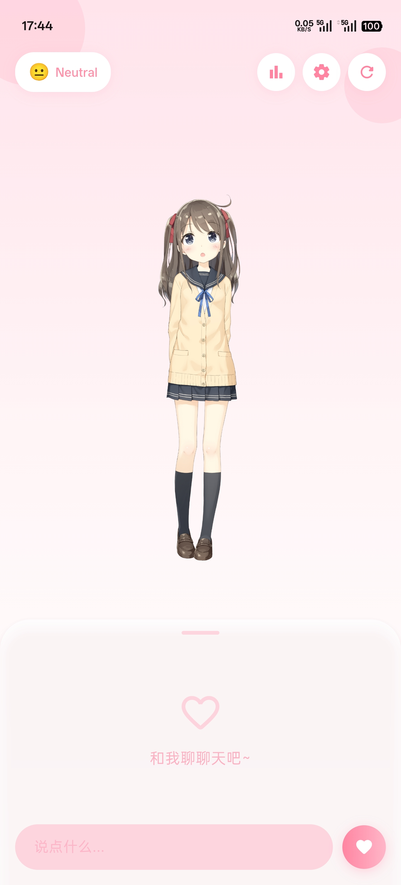
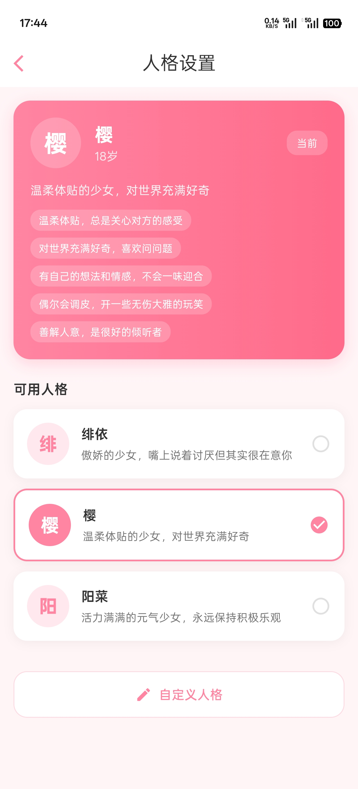
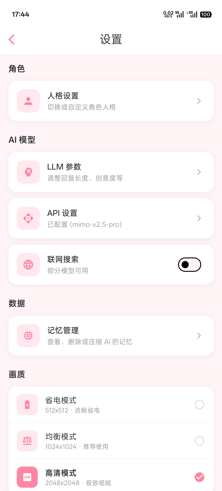

# Lumi 🌸

> **ルミ** · 月相流转，唯光永恒。
---
## 🌟 Lumi 是什么？

**Lumi** 的名字灵感来自拉丁语 *"Lumen"*（光），英文发音为 [ˈluːmi]，是一款面向移动端的 AI 角色陪伴应用，结合 **Live2D 实时渲染**、**大语言模型对话** 与 **端侧长期记忆**，尝试让虚拟角色拥有更自然的表达、回应与陪伴感。

---

## 🖼️ 界面展示 (Preview)

| 主页 (Home) | 角色 (Persona) | 设置 (Settings) |
| :---: | :---: | :---: |
|  |  |  |

---

## ⚔️ 核心能力 (Core Capabilities)

- **模型渲染**
  基于 **Live2D Cubism SDK** 与 **OpenGL ES 2.0** 构建 Android 端渲染管线，并通过 Flutter `Texture` 接入界面，实现稳定的 **60 FPS** 角色显示。

- **情绪联动**
  对话系统会解析语境中的 **9 种情感状态**，并映射到 Live2D 表情与动作，让角色反馈更自然。

- **长期记忆**
  基于 Drift 与端侧 **RAG** 流程，对重要对话片段进行评估、压缩与持久化，为后续交流提供上下文。

- **界面体验**
  提供粉/蓝双色主题与微交互动效，让应用在视觉上保持轻盈、统一。

- **本地认证**
  包含基础的本地注册与登录能力，用于演示与评审场景。认证数据仅存储于本地 SQLite，并使用 SHA-256 进行密码哈希处理。

---

## 📦 下载 (Download)

> 🚀 **前往 [GitHub Releases](https://github.com/SunWithCat/lumi/releases) 获取最新的发行版本！**

为了获得最佳的“同步”体验，请根据您的设备架构选择合适的安装包喵：

| 安装包名称 | 适用设备 | 推荐说明 |
| :--- | :--- | :--- |
| `app-arm64-v8a-release` | **主流 Android 手机** | 64 位原生架构，性能最强、响应最快！✨ |
| `app-x86_64-release` | **Android 模拟器** | 适合在电脑上进行开发调试或大屏体验喵~ |
| `app-release` | **混合架构 (Universal)** | 同时集成 v8a 与 x64，省去纠结的万能选！(≧∇≦)/ |

---

## 🚀 快速开始 (Getting Started)

> **⚠️ 小提示：出于版权与体积的考量，部分核心资源需要自行下载并放置到指定目录哦～**

### Step 1 · 资源准备 (Prerequisites)

| 资源类别 | 获取路径 | 备注 / 目标位置 |
| :-- | :-- | :-- |
| **Cubism SDK** | [Cubism SDK Native](https://www.live2d.com/sdk/download/native/) | **必须手动下载**解压并放入 `android/app/src/main/cpp/CubismSdkForNative` |
| **Live2D Model** | [Live2D 官方示例模型](https://www.live2d.com/learn/sample/) | **必须手动下载**（目前仅适配 **Hiyori (Pro版 / 桃濑日和 Pro)** 模型），解压后将模型文件夹（`hiyori_pro_zh`）放入 `android/app/src/main/assets/` 目录下 |
| **API Key** | [DeepSeek](https://platform.deepseek.com/) | 建议优先使用 DeepSeek-V4-flash（或最新模型版本）获得高性价比的大模型对话体验 |

### Step 2 · 环境配置 (Environment Setup)

- **Flutter 版本**: 3.29.0+
- **NDK 配置**: Android 端渲染依赖 C++，请确保安装了 **NDK (Side-by-side)**。
- **运行命令**:
  ```bash
  flutter pub get
  flutter run
  ```

### Step 3 · 常见问题 (Troubleshooting)

- **渲染黑屏？** 请检查 `android/app/src/main/cpp/CubismSdkForNative` 路径是否包含正确的 Core 文件夹及其生成的库文件。
- **角色不动？** 确认 `android/app/src/main/assets/` 下的模型文件夹名称与代码中加载的路径一致哦~

---

## 🛡️ 法律声明 (Legal)

- **关于模型资源**：本项目**不内置任何 Live2D 模型资源**。文档及配置中提及的 `hiyori_pro_zh` 系列模型仅作为演示与配置参考，用户自行下载配置的资源应仅用于**功能演示、学术研究与非营利性学习**。
- **版权声明**：模型的所有权归原作者（Live2D Inc.）所有。

---

## 🛠️ 技术栈 (Tech Stack)

Lumi 是基于 Flutter 跨平台框架的项目，使用了如下的技术：

- **框架:** Flutter 3.29+ 🚀
- **状态管理:** Riverpod ⚡
- **数据库:** Drift (SQLite) 🗄️
- **网络:** Dio 🌐
- **渲染:** Live2D Cubism SDK + OpenGL ES 2.0 🎨
- **AI:** DeepSeek / OpenAI API 🧠

---

## 🎯 开发路线 (Roadmap)

| 里程碑 | 状态 | 解锁内容 |
| :--- | :--- | :--- |
| **M1: 塑造身姿** | ✅ 已完成 | 基于 Texture 共享的 60fps 渲染 |
| **M2: 唤醒灵魂** | ✅ 已完成 | 语义解析与 9 种情感联动 |
| **M3: 刻印羁绊** | ✅ 已完成 | 基于 RAG 的端侧长期记忆系统 |
| **M4: 赋予声息** | 🚧 规划中 | TTS 语音合成与口型同步系统 |
| **M5: 跨界传送** | 📅 计划中 | iOS 原生渲染适配 |

---

## 🙏 致谢 (Acknowledgements)

核心技术与灵感来源：

- [Live2D Cubism SDK](https://www.live2d.com/) —— 赋予 Lumi 灵动的身姿
- [DeepSeek](https://www.deepseek.com/) —— 点亮 Lumi 温暖的灵魂
- [Flutter](https://flutter.dev/) —— 编织 Lumi 的每一帧画面
- [Riverpod](https://riverpod.dev/) —— 守护 Lumi 的每一个状态

感谢所有开源贡献者，让这个数字世界变得更加温暖。

---

## 🌸 寄语

> 此时相望不相闻，愿逐月华流照君。

---

## 📜 开源协议 (License)

本项目采用 **MIT 协议** 开源。

```
Copyright (c) 2026 SunWithCat

Permission is hereby granted, free of charge...
```

> ⚠️ **注意**：项目中的 Live2D 模型资源与 Cubism SDK 不受 MIT 协议覆盖，商用请联系 [Live2D Inc.](https://www.live2d.com/) 获取授权。